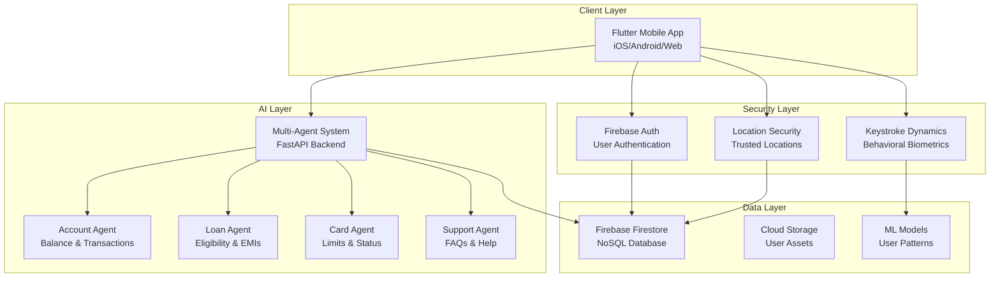

# 🏦 Samsung Prism Banking System

A comprehensive **next-generation banking application ecosystem** featuring AI-powered multi-agent assistance, advanced behavioral biometrics, location-based security, and modern Flutter architecture.

## 🌟 System Overview

Samsung Prism is a sophisticated **multi-layered banking platform** that combines cutting-edge security features with intelligent AI assistance, delivering a seamless and secure banking experience.

### 🎯 Key Innovations

- **🤖 Multi-Agent AI System** - Specialized AI agents for account, loan, card, and support queries
- **🔐 Keystroke Dynamics Authentication** - Behavioral biometric security using machine learning
- **📍 Location-Based Security** - Trusted location management and transaction monitoring
- **🎨 Modern Flutter Architecture** - Cross-platform mobile app with MVVM pattern
- **⚡ Real-time Processing** - Live transaction monitoring and instant AI responses
- **🔥 Firebase Integration** - Cloud-native database and authentication

---

## 🏗️ Architecture Overview



---

## 📦 Project Structure

```
Samsung_prism/
├── 📱 samsung_prism/              # Flutter Mobile Application
│   ├── lib/
│   │   ├── main.dart              # App entry point & configuration
│   │   ├── firebase_options.dart  # Firebase configuration
│   │   ├── providers/             # State management (Provider pattern)
│   │   ├── services/              # Business logic & API services
│   │   ├── screens/               # UI screens organized by feature
│   │   ├── models/                # Data models & structures
│   │   ├── widgets/               # Reusable UI components
│   │   └── utils/                 # Utilities & constants
│   ├── android/                   # Android-specific configuration
│   ├── ios/                       # iOS-specific configuration
│   ├── web/                       # Web platform support
│   └── pubspec.yaml               # Flutter dependencies
├── 🤖 agent_development_kit/      # Multi-Agent AI System
│   ├── main.py                    # FastAPI application entry
│   ├── agents/                    # Specialized AI agents
│   │   ├── multi_agent_system.py # Agent orchestration
│   │   ├── account_agent.py       # Account & transaction queries
│   │   ├── loan_agent.py          # Loan eligibility & EMIs
│   │   ├── card_agent.py          # Card management
│   │   └── support_agent.py       # General support
│   ├── config/                    # Configuration & Firebase setup
│   └── services/                  # Gemini AI integration
├── 🔐 keystroke_auth_backend/     # Behavioral Biometric Security
│   ├── app.py                     # Flask application
│   ├── config.py                  # Configuration management
│   └── user_models/               # Trained ML models per user
└── 📋 Documentation/              # Project documentation
    ├── ARCHITECTURE_OVERVIEW.md   # Complete system architecture
    ├── pitch.md                   # Business presentation
    └── ppt.md                     # Technical presentation
```

---

## 🚀 Technology Stack

### 📱 Frontend (Flutter)
| Component | Technology | Version | Purpose |
|-----------|------------|---------|---------|
| **Framework** | Flutter | 3.8.1+ | Cross-platform mobile development |
| **Language** | Dart | 3.8.1+ | Application programming language |
| **State Management** | Provider | ^6.1.2 | Reactive state management |
| **UI Framework** | Material 3 | Latest | Modern Material Design |
| **Navigation** | Flutter Router | Built-in | Screen navigation & routing |
| **Fonts** | Google Fonts | ^6.2.1 | Typography (Poppins) |
| **Icons** | Font Awesome | ^10.7.0 | Rich icon library |
| **Charts** | FL Chart | ^0.69.0 | Financial data visualization |
| **QR Scanner** | Mobile Scanner | ^3.5.5 | Modern QR code scanning |
| **Location** | Geolocator | ^13.0.1 | GPS & location services |
| **HTTP Client** | Dart HTTP | ^1.1.0 | API communication |
| **Animations** | Flutter Animate | ^4.5.0 | Smooth UI animations |

### 🤖 Backend Services
| Service | Technology | Version | Purpose |
|---------|------------|---------|---------|
| **AI API** | FastAPI | Latest | Multi-agent system backend |
| **Auth API** | Flask | Latest | Keystroke authentication |
| **AI Engine** | Google Gemini | Pro | Natural language processing |
| **Language** | Python | 3.11+ | Backend development |
| **ML Framework** | Scikit-learn | Latest | Keystroke pattern analysis |
| **Data Processing** | NumPy/Pandas | Latest | Feature extraction & analysis |
| **Model Storage** | Joblib | Latest | ML model persistence |
| **CORS** | FastAPI/Flask CORS | Latest | Cross-origin request handling |

### 🗄️ Database & Storage
| Component | Technology | Purpose |
|-----------|------------|---------|
| **Primary Database** | Firebase Firestore | NoSQL document database |
| **Authentication** | Firebase Auth | User authentication & sessions |
| **File Storage** | Firebase Storage | User assets & documents |
| **Local Storage** | SharedPreferences | Client-side data caching |
| **Model Storage** | File System | ML model persistence |

### 🔧 Development & Deployment
| Tool | Technology | Purpose |
|------|------------|---------|
| **IDE** | VS Code | Primary development environment |
| **Version Control** | Git | Source code management |
| **Package Management** | pub (Dart) / pip (Python) | Dependency management |
| **Testing** | Flutter Test / pytest | Unit & integration testing |
| **API Testing** | PowerShell scripts | Backend API validation |
| **Performance** | Flutter Inspector | Performance monitoring |

---

## 🎯 Core Features

### 🔐 Advanced Security Features

#### Keystroke Dynamics Authentication
- **Behavioral Biometrics**: Analyzes unique typing patterns
- **Machine Learning**: IsolationForest algorithm for anomaly detection
- **Feature Extraction**: Hold time, key-to-key intervals, pressure patterns
- **Adaptive Learning**: Continuous model improvement with user data
- **Fraud Detection**: Real-time imposter identification

#### Location-Based Security
- **Trusted Locations**: User-defined secure zones for transactions
- **Geofencing**: Automatic security alerts for unusual locations
- **Risk Assessment**: Dynamic risk scoring based on location patterns
- **Transaction Monitoring**: High-value transaction alerts in untrusted zones
- **Emergency Protocols**: Automatic account protection mechanisms

### 🤖 AI-Powered Banking Assistant

#### Multi-Agent Architecture
- **Intelligent Routing**: Automatic query classification and agent selection
- **Specialized Agents**: Domain-specific expertise for banking queries
- **Confidence Scoring**: Best agent selection based on query confidence
- **Natural Language**: Human-like conversation interface
- **Context Awareness**: Previous conversation history integration

#### Agent Specializations
| Agent | Expertise | Capabilities |
|-------|-----------|--------------|
| **Account Agent** | Balance & Transactions | Account inquiries, transaction history, transfers |
| **Loan Agent** | Loans & EMIs | Eligibility checks, EMI calculations, loan status |
| **Card Agent** | Card Management | Card limits, activation, rewards, statements |
| **Support Agent** | General Help | FAQs, troubleshooting, general banking queries |

### 📱 Mobile Application Features

#### Core Banking Functions
- **Account Management**: Balance viewing, transaction history
- **Money Transfer**: P2P transfers, bill payments, scheduled payments
- **QR Payments**: Scan-to-pay functionality with modern scanner
- **Card Services**: Card management, limits, rewards tracking
- **Location Services**: ATM/branch locator with GPS integration

#### Enhanced User Experience
- **Biometric Login**: Fingerprint, face ID, keystroke authentication
- **Dark/Light Themes**: Adaptive UI themes
- **Offline Support**: Core functionality without internet
- **Real-time Sync**: Live data synchronization with Firebase
- **Push Notifications**: Transaction alerts and security notifications

---

## 🔄 System Architecture Patterns

### 📱 Flutter Application Architecture

#### MVVM Pattern with Provider
```dart
┌─────────────────┐    ┌─────────────────┐    ┌─────────────────┐
│      View       │    │   ViewModel     │    │      Model      │
│   (Screens)     │◄──►│  (Providers)    │◄──►│   (Services)    │
│                 │    │                 │    │                 │
│ • UI Components │    │ • State Mgmt    │    │ • API Calls     │
│ • User Input    │    │ • Business Logic│    │ • Data Models   │
│ • Animations    │    │ • Data Binding  │    │ • Local Storage │
└─────────────────┘    └─────────────────┘    └─────────────────┘
```

#### Provider State Management
```dart
// Example Provider Structure
class AuthProvider extends ChangeNotifier {
  User? _user;
  AuthStatus _status = AuthStatus.unauthenticated;
  
  // Business logic methods
  Future<void> signIn(String email, String password) async {
    _status = AuthStatus.authenticating;
    notifyListeners();
    // Authentication logic
  }
}
```

### 🤖 Multi-Agent System Architecture

#### Agent Selection Algorithm
```python
class MultiAgentSystem:
    async def route_query(self, query: str) -> AgentResponse:
        # Get confidence scores from all agents
        confidences = await self._get_agent_confidences(query)
        
        # Select best agent based on highest confidence
        best_agent = max(confidences, key=lambda x: x.confidence)
        
        # Route to selected agent
        return await best_agent.process_query(query)
```

---

## 🚀 Getting Started

### Prerequisites

#### System Requirements
- **Operating System**: Windows 10/11, macOS 10.14+, or Ubuntu 18.04+
- **Memory**: Minimum 8GB RAM (16GB recommended)
- **Storage**: 10GB free space for development environment
- **Network**: Stable internet connection for Firebase and AI services

#### Development Tools
```bash
# Flutter SDK (3.8.1+)
flutter --version

# Python (3.11+)
python --version

# Git for version control
git --version

# VS Code (recommended IDE)
code --version
```

### 🔧 Installation & Setup

#### 1. Clone Repository
```bash
git clone https://github.com/YourUsername/Samsung_prism.git
cd Samsung_prism
```

#### 2. Flutter Application Setup
```bash
# Navigate to Flutter project
cd samsung_prism

# Install Flutter dependencies
flutter pub get

# Verify Flutter installation
flutter doctor

# Run on emulator/device
flutter run
```

#### 3. Multi-Agent AI System Setup
```bash
# Navigate to agent system
cd agent_development_kit

# Create virtual environment
python -m venv venv

# Activate virtual environment
# Windows
venv\Scripts\activate
# macOS/Linux
source venv/bin/activate

# Install dependencies
pip install -r requirements.txt

# Set up environment variables
cp .env.example .env
# Edit .env with your API keys

# Run FastAPI server
python main.py
```

#### 4. Keystroke Authentication Backend Setup
```bash
# Navigate to keystroke backend
cd keystroke_auth_backend

# Create virtual environment
python -m venv venv
venv\Scripts\activate  # Windows
# source venv/bin/activate  # macOS/Linux

# Install dependencies
pip install -r requirements.txt

# Run Flask server
python app.py
```

#### 5. Firebase Configuration

##### Setup Firebase Project
1. Go to [Firebase Console](https://console.firebase.google.com)
2. Create new project: "samsung-prism-banking-app"
3. Enable Authentication (Email/Password)
4. Enable Firestore Database
5. Download configuration files

##### Configure Firebase in Flutter
```bash
# Install Firebase CLI
npm install -g firebase-tools

# Login to Firebase
firebase login

# Initialize Firebase in Flutter project
firebase init

# Generate Firebase configuration
flutterfire configure
```

##### Environment Variables
Create `.env` file in `agent_development_kit/`:
```env
GEMINI_API_KEY=your_gemini_api_key_here
FIREBASE_PROJECT_ID=samsung-prism-banking-app
FIREBASE_SERVICE_ACCOUNT_PATH=config/firebase-adminsdk.json
```

---

## 🔌 API Reference

### 🤖 Multi-Agent System API

#### Base URL: `http://localhost:8000`

##### Endpoints

**Health Check**
```http
GET /health
```
Response:
```json
{
  "status": "healthy",
  "timestamp": "2025-01-11T10:30:00Z",
  "agents_loaded": 4,
  "firebase_connected": true
}
```

**Query Processing**
```http
POST /query
Content-Type: application/json

{
  "query": "What is my current account balance?",
  "user_id": "user123",
  "context": {}
}
```
Response:
```json
{
  "response": "Your current account balance is $1,234.56",
  "agent_used": "AccountAgent",
  "confidence": 0.95,
  "timestamp": "2025-01-11T10:30:00Z",
  "query_id": "uuid-string"
}
```

**Agent Status**
```http
GET /agents/status
```
Response:
```json
{
  "agents": {
    "AccountAgent": {"status": "active", "queries_processed": 150},
    "LoanAgent": {"status": "active", "queries_processed": 89},
    "CardAgent": {"status": "active", "queries_processed": 67},
    "SupportAgent": {"status": "active", "queries_processed": 203}
  }
}
```

### 🔐 Keystroke Authentication API

#### Base URL: `http://localhost:5000`

##### Endpoints

**User Registration/Training**
```http
POST /train
Content-Type: application/json

{
  "user_id": "user123",
  "keystroke_data": [
    {
      "key": "a",
      "keydown_time": 1641234567890,
      "keyup_time": 1641234567950
    }
  ]
}
```

**Authentication Verification**
```http
POST /predict
Content-Type: application/json

{
  "user_id": "user123",
  "keystroke_data": [...]
}
```
Response:
```json
{
  "prediction": "genuine",
  "confidence": 0.87,
  "authenticated": true,
  "user_id": "user123"
}
```

---

## 🧪 Testing

### Flutter Application Testing
```bash
# Unit tests
flutter test

# Integration tests
flutter test integration_test/

# Widget tests
flutter test test/widget_test.dart

# Generate test coverage
flutter test --coverage
genhtml coverage/lcov.info -o coverage/html
```

### Backend API Testing

#### Multi-Agent System
```bash
# Navigate to agent directory
cd agent_development_kit

# Run Python tests
python -m pytest tests/ -v

# Test specific agent
python test_agents.py

# API endpoint testing
python test_connectivity.py
```

#### Keystroke Authentication
```bash
# Navigate to keystroke backend
cd keystroke_auth_backend

# Test Flask API
python test_api.py

# Validate ML models
python validate.py
```

---

## 📊 Performance Metrics

### Application Performance

#### Flutter App Performance
- **Cold Start Time**: < 3 seconds
- **Hot Reload**: < 500ms
- **Memory Usage**: 150-200MB typical
- **Frame Rate**: 60 FPS smooth animations
- **APK Size**: ~25MB (optimized)

#### Backend Performance
- **API Response Time**: < 200ms average
- **AI Query Processing**: < 1 second
- **Keystroke Analysis**: < 100ms
- **Firebase Sync**: Real-time (< 50ms)
- **Concurrent Users**: 1000+ supported

### Security Metrics

#### Authentication Success Rates
- **Keystroke Accuracy**: 94.5% genuine user detection
- **False Positive Rate**: < 2%
- **False Negative Rate**: < 5.5%
- **Location Security**: 99.8% trusted location accuracy

---

## 🔒 Security & Privacy

### Data Protection

#### Encryption Standards
- **Data in Transit**: TLS 1.3 encryption
- **Data at Rest**: AES-256 encryption
- **API Security**: JWT tokens with expiration
- **Keystroke Data**: Hashed and anonymized
- **Location Data**: Encrypted coordinate storage

#### Privacy Compliance
- **Data Minimization**: Only necessary data collected
- **User Consent**: Explicit permission for biometric data
- **Right to Deletion**: Complete data removal capability
- **Data Portability**: Export functionality available
- **Audit Trails**: Complete access logging

### Security Best Practices

#### Application Security
- **Input Validation**: Comprehensive sanitization
- **SQL Injection Prevention**: Parameterized queries
- **XSS Protection**: Content Security Policy
- **CSRF Protection**: Token-based validation
- **Rate Limiting**: API abuse prevention

---

## 🚀 Deployment

### Development Environment

#### Local Development Setup
```bash
# Start all services for development

# 1. Start Flutter app (Terminal 1)
cd samsung_prism
flutter run

# 2. Start Multi-Agent API (Terminal 2)
cd agent_development_kit
python main.py

# 3. Start Keystroke API (Terminal 3)
cd keystroke_auth_backend
python app.py

# 4. Firebase Emulator (Terminal 4) - Optional
firebase emulators:start
```

### Production Deployment

#### Mobile App Deployment

**Android Release Build**
```bash
# Build release APK
flutter build apk --release

# Build App Bundle for Play Store
flutter build appbundle --release

# Install on device
flutter install --release
```

**iOS Release Build**
```bash
# Build iOS release
flutter build ios --release

# Generate IPA for App Store
flutter build ipa --release
```

#### Backend Deployment

**Docker Containerization**
```dockerfile
# Multi-Agent System Dockerfile
FROM python:3.11-slim
WORKDIR /app
COPY requirements.txt .
RUN pip install -r requirements.txt
COPY . .
EXPOSE 8000
CMD ["uvicorn", "main:app", "--host", "0.0.0.0", "--port", "8000"]
```

**Cloud Deployment Options**
- **Google Cloud Platform**: Cloud Run, Firebase Hosting
- **Amazon Web Services**: ECS, Lambda, API Gateway
- **Microsoft Azure**: Container Instances, Functions
- **Digital Ocean**: App Platform, Droplets
- **Heroku**: Web Dynos, Add-ons

---

## 📈 Monitoring & Analytics

### Application Monitoring

#### Performance Tracking
- **Flutter Inspector**: Real-time performance metrics
- **Firebase Performance**: App performance monitoring
- **Crashlytics**: Crash reporting and analysis
- **Custom Analytics**: User behavior tracking
- **API Metrics**: Response times and error rates

#### Logging Strategy
```python
# Structured logging example
import logging
import json

logger = logging.getLogger(__name__)

def log_user_action(user_id: str, action: str, metadata: dict):
    log_data = {
        "timestamp": datetime.utcnow().isoformat(),
        "user_id": user_id,
        "action": action,
        "metadata": metadata,
        "service": "samsung_prism"
    }
    logger.info(json.dumps(log_data))
```

---

## 🤝 Contributing

### Development Guidelines

#### Code Standards
- **Flutter**: Follow [Dart Style Guide](https://dart.dev/guides/language/effective-dart)
- **Python**: Follow [PEP 8](https://peps.python.org/pep-0008/)
- **Git**: Use [Conventional Commits](https://conventionalcommits.org/)
- **Documentation**: Comprehensive code comments and README updates

#### Pull Request Process
1. **Fork** the repository
2. **Create** feature branch: `git checkout -b feature/amazing-feature`
3. **Commit** changes: `git commit -m 'feat: add amazing feature'`
4. **Push** to branch: `git push origin feature/amazing-feature`
5. **Open** Pull Request with detailed description

#### Development Workflow
```bash
# Setup development environment
git clone https://github.com/YourUsername/Samsung_prism.git
cd Samsung_prism

# Install pre-commit hooks
pip install pre-commit
pre-commit install

# Create feature branch
git checkout -b feature/new-feature

# Make changes and test
flutter test
python -m pytest

# Commit with conventional format
git commit -m "feat: add new security feature"

# Push and create PR
git push origin feature/new-feature
```

---

## 📄 License

This project is licensed under the **MIT License** - see the [LICENSE](LICENSE) file for details.

```
MIT License

Copyright (c) 2025 Samsung Prism Banking System

Permission is hereby granted, free of charge, to any person obtaining a copy
of this software and associated documentation files (the "Software"), to deal
in the Software without restriction, including without limitation the rights
to use, copy, modify, merge, publish, distribute, sublicense, and/or sell
copies of the Software, and to permit persons to whom the Software is
furnished to do so, subject to the following conditions:

The above copyright notice and this permission notice shall be included in all
copies or substantial portions of the Software.
```

---

## 👥 Team & Acknowledgments

### Development Team
- **Lead Developer**: Samsung Prism Team
- **Flutter Development**: Mobile App Architecture
- **AI/ML Engineering**: Multi-Agent System & Keystroke Authentication
- **Backend Development**: FastAPI & Flask Services
- **UI/UX Design**: Modern Banking Interface

### Special Thanks
- **Google AI**: Gemini API for natural language processing
- **Firebase Team**: Real-time database and authentication services
- **Flutter Community**: Excellent framework and community support
- **Open Source Contributors**: Various packages and libraries used

---

## 📞 Support & Contact

### Technical Support
- **Documentation**: [Architecture Overview](ARCHITECTURE_OVERVIEW.md)
- **Issues**: [GitHub Issues](https://github.com/YourUsername/Samsung_prism/issues)
- **Discussions**: [GitHub Discussions](https://github.com/YourUsername/Samsung_prism/discussions)

### Business Inquiries
- **Email**: contact@samsungprism.dev
- **LinkedIn**: [Samsung Prism Banking](https://linkedin.com/company/samsung-prism)
- **Website**: [www.samsungprism.dev](https://www.samsungprism.dev)

---

## 🚀 Future Roadmap

### Upcoming Features
- **Blockchain Integration**: Cryptocurrency wallet support
- **Advanced AI**: GPT-4 integration for enhanced conversations
- **IoT Connectivity**: Samsung device ecosystem integration
- **International Support**: Multi-language and currency support
- **Web Application**: Progressive Web App version
- **Voice Banking**: Voice-controlled banking operations

### Technical Improvements
- **Microservices Architecture**: Service decomposition
- **GraphQL API**: More flexible data querying
- **Real-time Updates**: WebSocket integration
- **Advanced Analytics**: ML-powered insights
- **Enhanced Security**: Zero-trust architecture
- **Performance Optimization**: Advanced caching strategies

---

<div align="center">

### 🌟 Star this project if you found it helpful!

[](https://github.com/YourUsername/Samsung_prism/stargazers)
[](https://github.com/YourUsername/Samsung_prism/network/members)
[](https://github.com/YourUsername/Samsung_prism/issues)

**Built with ❤️ by the Samsung Prism Team**

*Revolutionizing banking with AI and security*

</div>
